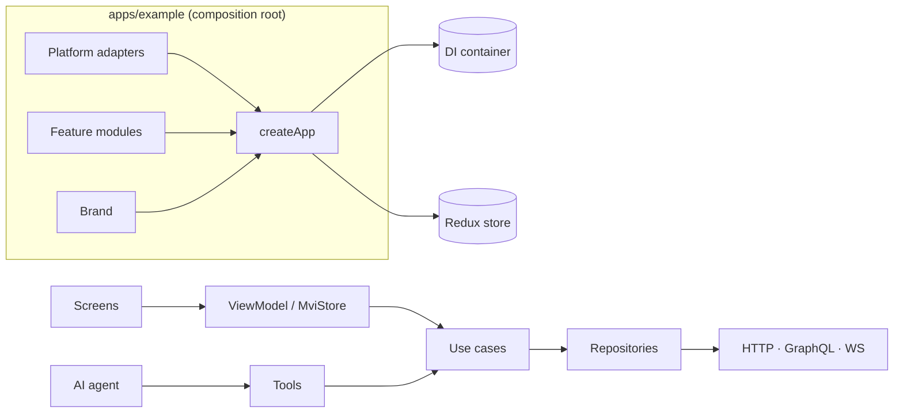

<div align="center">


# Mobile App Framework — White-Label, AI-Native React Native Framework

**Build one React Native codebase and ship it as many branded iOS & Android apps.**
Strict TypeScript · Clean Architecture · MVVM & MVI · Dependency Injection · Redux Toolkit · REST / GraphQL / WebSocket · i18n & RTL · Design Tokens · Observability · LLM tool calling

[](https://github.com/llRizvanll/Mobile-Apps-Framework/actions/workflows/ci.yml)
[](https://llrizvanll.github.io/Mobile-Apps-Framework/)
[](https://github.com/llRizvanll/Mobile-Apps-Framework/actions/workflows/codeql.yml)


[](CONTRIBUTING.md)

[**Documentation**](https://llrizvanll.github.io/Mobile-Apps-Framework/) ·
[Quick start](https://llrizvanll.github.io/Mobile-Apps-Framework/guide/getting-started) ·
[Workflows](https://llrizvanll.github.io/Mobile-Apps-Framework/workflows/) ·
[Architecture](docs/architecture.md) ·
[FAQ](docs/faq.md)

</div>

---

**Mobile App Framework** is an open-source **React Native framework and starter kit** for teams that ship
**white-label (multi-brand) mobile apps** or want a **production-grade architecture** from day one. The framework
packages (`@org/*`) provide clean architecture, typed dependency injection, resilient networking, state management,
theming, internationalization, observability and **AI-native** building blocks. Brands are small packages you can
generate with one command, and a reference **Expo** app shows every piece working together.

## Table of contents

- [Why this framework](#why-this-framework)
- [Features](#features)
- [Architecture at a glance](#architecture-at-a-glance)
- [Quick start](#quick-start)
- [White-label: one codebase, many apps](#white-label-one-codebase-many-apps)
- [AI-native](#ai-native)
- [Project structure](#project-structure)
- [Documentation](#documentation)
- [Contributing](#contributing)

## Why this framework

| Common pain                                                 | What you get here                                                                                        |
| ----------------------------------------------------------- | -------------------------------------------------------------------------------------------------------- |
| Architecture drifts as the team or AI agents add code       | Layer boundaries are **generated from `package.json` and enforced by ESLint** in CI                      |
| Every brand is a fork                                       | **Brand packages**: validated config, per-environment overlays, design tokens, copy, component overrides |
| Token refresh races, retry storms, unhandled network errors | A **`Result`-based HTTP pipeline** with single-flight refresh, backoff with Retry-After, and tracing     |
| Business logic hidden in components                         | **Use cases** behind ports, with **MVVM** view models or **MVI** stores, all testable without rendering  |
| Vendor lock-in (analytics, crash, storage, LLM)             | **Ports & adapters**: swap MMKV, Sentry, Segment or the LLM vendor in one file                           |
| AI features bolted on unsafely                              | **Tools on top of use cases**, zod-validated input, human confirmation, content never logged             |

## Features

**Architecture**

- Hexagonal packages + clean-architecture features (`domain` → `data` → `presentation`), enforced by lint
- Typed **dependency injection** without decorators: singleton/scoped/transient, multi-bindings, cycle detection
- **MVVM** (`ViewModel`) and **MVI** (`MviStore`), React-free and StrictMode-safe
- **Feature modules** with dependencies, feature flags, lifecycle hooks, reducers, translations and AI tools

**Data & state**

- **REST** client returning `Result<T, AppError>`: middleware pipeline, retries, **OAuth token refresh**, zod response validation
- **GraphQL** queries and mutations (codegen-typed) + **subscriptions** over `graphql-transport-ws`
- **WebSocket** client with exponential-backoff reconnect, offline queue and heartbeat
- **Redux Toolkit** with a typed state registry, lazy slices, and **versioned persistence with migrations**
- Storage ports: key-value (MMKV / AsyncStorage), **secure storage** (Keychain/Keystore), **SQLite** with migrations

**Experience**

- **Design tokens** (base → semantic → component), light/dark, **WCAG contrast audit**
- **Atomic design** UI kit (atoms → templates) with a **brand override registry**, accessible by default
- **i18n**: ICU-style interpolation, `Intl` plurals, lazy locales, compile-time checked keys, **RTL**

**Operations**

- Structured logging with **PII redaction**, crash reporting, **consent-aware analytics**, **W3C traceparent** tracing
- Traced boot phases, typed analytics events, global error handler + React error boundary

**Developer experience**

- Generators: `gen:feature`, `gen:brand` · strict TS (`exactOptionalPropertyTypes`) · Jest + RNTL test harness
- `AGENTS.md`, `CLAUDE.md`, `llms.txt`, Claude Code skills for **AI coding agents**
- CI: format, typecheck, lint, tests, per-brand Metro bundle, CodeQL, docs deploy

## Architecture at a glance



Read more: [Architecture](docs/architecture.md) · [App boot](docs/workflows/app-boot.md) · [Request lifecycle](docs/workflows/request-lifecycle.md) · [AI agent loop](docs/workflows/ai-agent.md)

## Quick start

```bash
git clone https://github.com/llRizvanll/Mobile-Apps-Framework.git
cd Mobile-Apps-Framework
npm install
npm run verify                                  # typecheck + lint + tests

cd apps/example
EXPO_PUBLIC_BRAND=acme npx expo run:ios         # runs against a built-in mock API
```

Create things:

```bash
npm run gen:feature -- orders --flag
npm run gen:brand -- initech --name "Initech Ops" --bundle com.initech.ops --color "#6A1B9A"
```

## White-label: one codebase, many apps

```ts
export default defineBrand({
  config: { id: 'acme', api: { rest: { baseUrl: 'https://api.acme.example/v1' } }, features: { assistant: true }, ... },
  environments: { production: { observability: { logLevel: 'warn', requireConsent: true } } },
  theme: { colors: { light: { primary: '#C2185B' } }, components: { button: { radius: 'pill' } } },
  translations: { en: { brand: { tagline: 'Get things done.' } } },
  components: { Button: AcmeButton },
});
```

```bash
EXPO_PUBLIC_BRAND=globex npx expo run:ios       # different name, bundle id, theme, flags, copy
```

Every brand is contract-tested: its config must be valid in **every environment** and its colours must pass **WCAG AA**. → [White-label release workflow](docs/workflows/white-label-release.md)

## AI-native

- **In the app**: features expose typed **tools** (`todos.add`) backed by the same use cases as the UI. A vendor-neutral `AIClient` talks to your backend, and the agent loop asks the user to confirm side effects. → [AI agent workflow](docs/workflows/ai-agent.md)
- **For coding agents**: [`AGENTS.md`](AGENTS.md), [`CLAUDE.md`](CLAUDE.md), [`llms.txt`](llms.txt), [skills](.claude/skills), generators, and lint that keeps agents inside the architecture. → [AI-native development](docs/guide/ai-native.md)

## Project structure

```text
packages/        @org/* framework: foundation · di · observability · storage · network · state
                 i18n · theme · presentation · ui · ai · core · testing
brands/          acme · globex (config, theme, copy, overrides, native.json)
apps/example/    Expo reference app: todos (MVVM), assistant (MVI + AI), settings
scripts/         generators, docs sync
docs/            VitePress site: guides, workflows, ADRs, reference
```

Full tour: [Project structure](docs/guide/project-structure.md) · [Learning path](docs/guide/learning-path.md)

## Documentation

| Guide                                            | Workflows                                                               | Reference                                    |
| ------------------------------------------------ | ----------------------------------------------------------------------- | -------------------------------------------- |
| [Introduction](docs/guide/introduction.md)       | [App boot](docs/workflows/app-boot.md)                                  | [Packages](docs/reference/README.md)         |
| [Quick start](docs/guide/getting-started.md)     | [Request lifecycle](docs/workflows/request-lifecycle.md)                | [Architecture decisions](docs/adr/README.md) |
| [Core concepts](docs/guide/core-concepts.md)     | [State & persistence](docs/workflows/state-and-persistence.md)          | [Glossary](docs/glossary.md)                 |
| [Building features](docs/features.md)            | [Feature development](docs/workflows/feature-development.md)            | [FAQ](docs/faq.md)                           |
| [Brands](docs/brands.md)                         | [White-label release](docs/workflows/white-label-release.md)            | [Troubleshooting](docs/troubleshooting.md)   |
| [AI-native development](docs/guide/ai-native.md) | [Testing](docs/workflows/testing.md) · [CI/CD](docs/workflows/ci-cd.md) | [AGENTS.md](AGENTS.md)                       |

## Contributing

Contributions are welcome. Read [CONTRIBUTING.md](CONTRIBUTING.md), follow the [Code of Conduct](CODE_OF_CONDUCT.md), and report vulnerabilities privately as described in [SECURITY.md](SECURITY.md).

If this project helps you, please ⭐ **star the repo**. It helps other React Native developers find it.

<sub>Keywords: React Native framework, React Native boilerplate, white-label mobile app, multi-brand app, Expo monorepo, TypeScript, clean architecture, MVVM, MVI, dependency injection, Redux Toolkit, GraphQL, WebSocket, i18n, RTL, design system, observability, AI agents, LLM tool calling.</sub>
