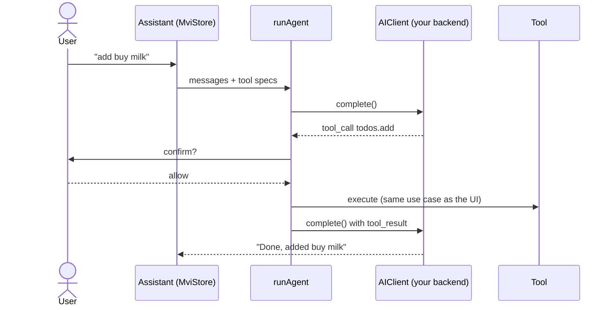

# AI

## In the app: tools over your use cases

Features expose capabilities as typed **tools**, and the assistant's agent loop calls them. Tools go through the same use
cases as the UI, so validation, analytics and permissions apply equally.

```ts
defineTool({
  name: 'todos.add',
  description: 'Create a task for the user.',
  inputSchema: { type: 'object', properties: { title: { type: 'string' } }, required: ['title'] },
  parser: z.object({ title: z.string() }), // model input validated before execution
  requiresConfirmation: true, // user must approve side effects
  execute: async ({ title }) => unwrap(await addTodo.execute(title)),
});
```



Safety rails: zod-validated input, confirmation for side effects, tool errors returned to the model (not thrown), `maxSteps`, cancel on unmount,
and no prompt or response content in logs (only tiers, sizes, latency, tokens). Vendor keys never ship in the app (see [integrations](integrations.md#ai-backend-contract)).
In tests use `ScriptedAIClient([toolUseResponse(...), textResponse(...)])`. The mock backend fakes the loop offline.

## For AI coding agents

| Asset                                                         | Purpose                                                                                                                                                                      |
| ------------------------------------------------------------- | ---------------------------------------------------------------------------------------------------------------------------------------------------------------------------- |
| `AGENTS.md` (+ `src/framework`, `src/features`, `src/brands`) | commands, invariants, where code goes, local rules                                                                                                                           |
| `CLAUDE.md` files                                             | import the matching `AGENTS.md` for Claude Code                                                                                                                              |
| `.claude/skills/`                                             | task playbooks: `new-feature`, `feature-flags`, `new-brand`, `integrations`, `extend-framework`, `write-tests`, `build-and-release`, `adopt-template`, `architecture-review` |
| `llms.txt`                                                    | index for LLMs                                                                                                                                                               |
| generators + `npm run flags`                                  | agents scaffold and toggle correctly instead of copying files                                                                                                                |
| `npm run verify` + `flags doctor`                             | fast, precise feedback: layer violations, invalid translation keys, unregistered flags                                                                                       |
