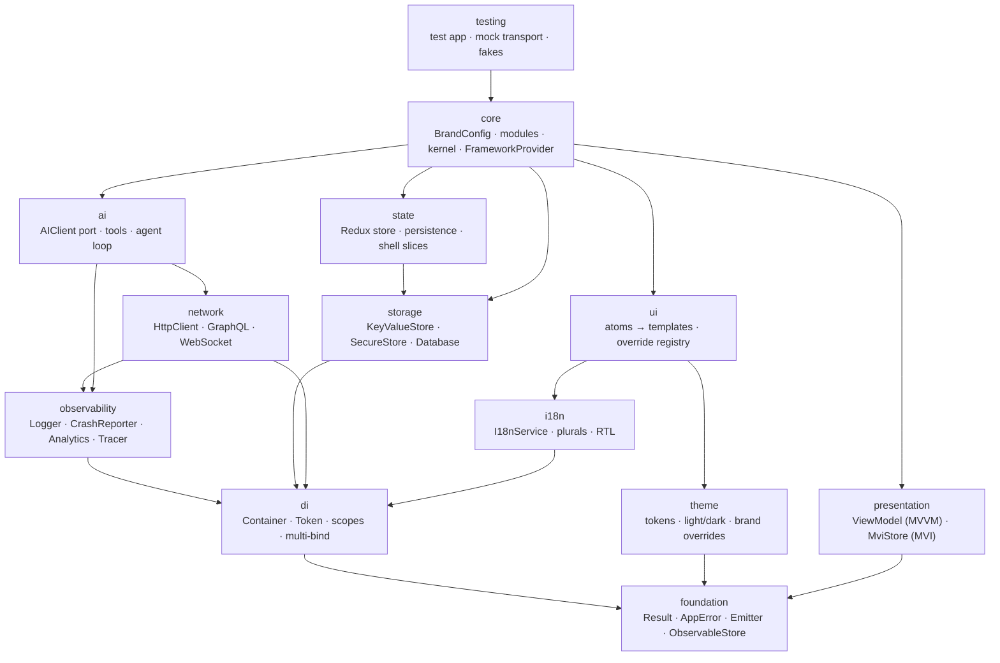

# Architecture

> Hexagonal (ports & adapters) framework + clean-architecture features + a module kernel.
> Everything above the adapters is plain TypeScript that runs in Jest/Node without a device.

## Layer graph

Arrows mean "may import". Enforced by ESLint (`no-restricted-imports`), generated from each
package's `package.json` dependencies — **to add an edge, add the dependency; review it here first.**



| Package         | Owns                                                                                                                                   | Key ports (interfaces you implement)                                          |
| --------------- | -------------------------------------------------------------------------------------------------------------------------------------- | ----------------------------------------------------------------------------- |
| `foundation`    | `Result`, `AppError` taxonomy, `Emitter`, `ObservableStore`, `deepMerge`, backoff, `singleFlight`, `Clock`                             | `Parser<T>` (zod-compatible)                                                  |
| `di`            | Typed container, `Token<T>`, singleton/scoped/transient, multi-bindings, cycle detection                                               | `ServiceModule`                                                               |
| `observability` | Logger with PII redaction, composite analytics w/ consent, tracer (W3C traceparent)                                                    | `LogSink`, `CrashReporter`, `AnalyticsProvider`, `SpanExporter`               |
| `storage`       | Namespacing, typed/TTL entries, SQL migrations                                                                                         | `KeyValueStore`, `SecureStore`, `Database`, `Repository<T>`                   |
| `network`       | REST client (Result-based), middleware (auth refresh, retry, tracing, logging), GraphQL, resilient WebSocket, graphql-ws subscriptions | `HttpTransport`, `AccessTokenProvider`, `AuthRefreshPort`, `WebSocketFactory` |
| `state`         | Store factory, lazy reducers, versioned persistence + migrations, shell slices (`app`, `session`, `settings`)                          | —                                                                             |
| `i18n`          | ICU-lite interpolation, `Intl.PluralRules`, locale fallback chains, lazy locales, RTL sync                                             | `LayoutDirectionAdapter`, device locales                                      |
| `theme`         | Base → semantic → component tokens, light/dark, WCAG contrast audit                                                                    | —                                                                             |
| `presentation`  | `ViewModel` (MVVM), `MviStore` (MVI), React bindings                                                                                   | —                                                                             |
| `ui`            | Atomic components, brand override registry                                                                                             | `UIComponentMap` slots                                                        |
| `ai`            | Vendor-neutral chat/stream API, tool registry, agent loop, SSE, observability decorator                                                | `AIClient`, `AITool`                                                          |
| `core`          | Brand config (zod), module system, kernel, `FrameworkProvider`, feature flags                                                          | `PlatformAdapters`, `RemoteConfigProvider`                                    |

## Feature architecture (clean architecture)

```
features/<name>/
  domain/        entities, value rules, repository PORTS, use cases     ← pure TS, no React/IO
  data/          DTO schemas (zod), mappers, repository ADAPTERS         ← HttpClient, storage
  presentation/  ViewModel (MVVM) or MviStore (MVI) + screens           ← React, @org/ui
  ai/            AITool definitions calling the same use cases
  tokens.ts      DI tokens for this feature
  translations.ts
  module.ts      the ONLY thing the app imports
```

Dependencies point inward: `presentation → domain ← data`. Lint enforces it.

**MVVM or MVI?** Use a `ViewModel` for CRUD-ish screens (state + commands). Use an `MviStore` when
the flow is a state machine or needs an auditable intent log (chat, checkout, onboarding, multi-step
forms). Both are React-free and unit-testable.

## Composition & boot

```
createApp({ brand, environment, modules, adapters })
  ├─ resolveBrandConfig     base ⊕ env overlay → zod validation → deep-frozen
  ├─ resolveModules         feature-flag filter → dependency topo-sort (cycle/missing checks)
  ├─ Container              framework services → module.register() → overrides (tests)
  └─ createAppStore         shell + module reducers, persistence middleware

app.start()   (traced: app.start.* spans)
  rehydrate → locale (persisted ▸ device ▸ default, RTL sync) → remote flags → consent
  → register AI tools → wire shell effects → module.onStart() (dependency order) → phase=ready
```

`FrameworkProvider` = Redux → DI → i18n → Theme (persisted preference) → UI overrides → ErrorBoundary
(→ CrashReporter), gating on boot phase with retry.

## HTTP pipeline (outermost first)

`headers (brand, locale, version) → tracing (traceparent) → logging → retry → auth (401 → single-flight refresh → replay) → module middleware → status check → transport`

Clients return `Result<HttpResponse<T>, AppError>`; nothing throws across the data boundary.

## Design patterns in use

| Pattern                                                 | Where                                                        |
| ------------------------------------------------------- | ------------------------------------------------------------ |
| Ports & Adapters                                        | every native/vendor dependency (`PlatformAdapters`)          |
| Dependency Injection / Service Locator at the edge only | `Container`; features get deps via constructors              |
| Composite                                               | analytics providers, crash reporters, log sinks              |
| Decorator                                               | `CachedTodoRepository`, `withObservability(AIClient)`        |
| Chain of Responsibility                                 | HTTP middleware                                              |
| Strategy                                                | `HttpTransport`, `WebSocketFactory`, `AIClient` adapters     |
| Observer                                                | `Emitter`, `ObservableStore`, Redux listeners                |
| Repository                                              | `domain/*Repository.ts` ports                                |
| Plugin / Module                                         | `FrameworkModule`, multi-bindings (tools, middleware, sinks) |
| Registry                                                | UI component overrides, AI `ToolRegistry`                    |
| Single-flight                                           | token refresh                                                |

## Observability

- **Logs**: structured, levelled, PII keys redacted before any sink; errors → crash reporter, others → breadcrumbs.
- **Traces**: boot phases, every HTTP call (propagated to backend via `traceparent`), AI calls.
- **Analytics**: typed event map (declaration merging), consent-gated, super-props (brand/env/version).
- **Crashes**: global JS handler + React error boundary, tagged with brand/env, user set on sign-in.
