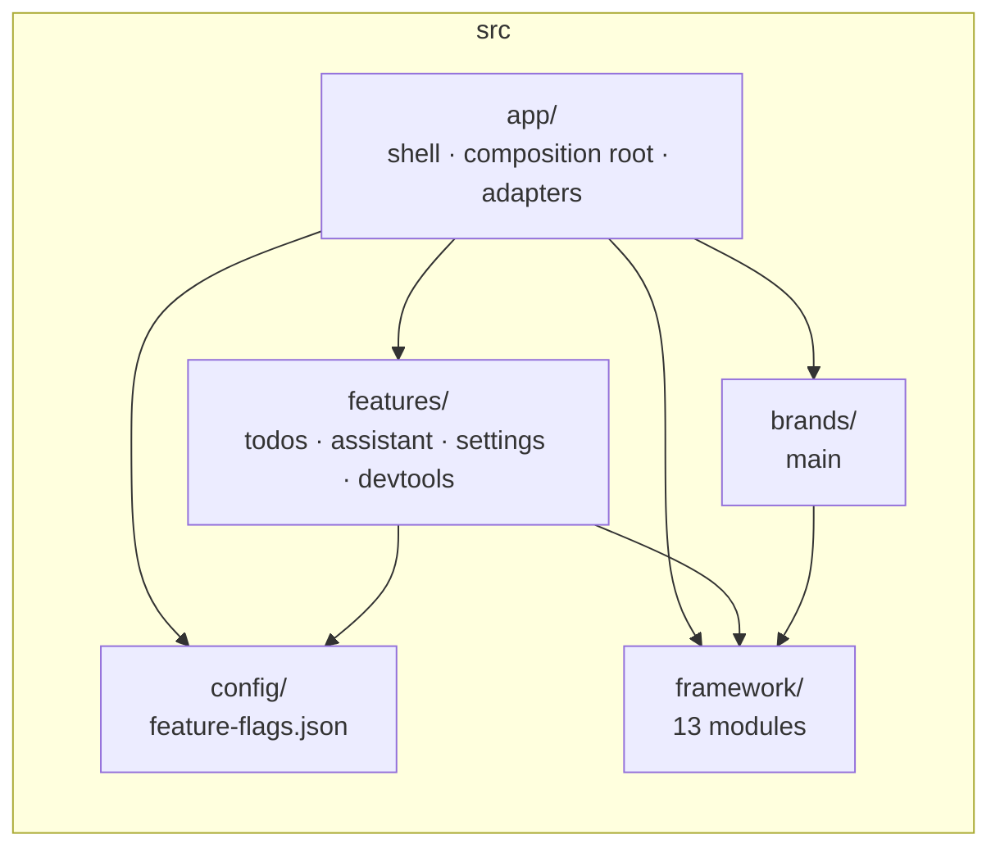
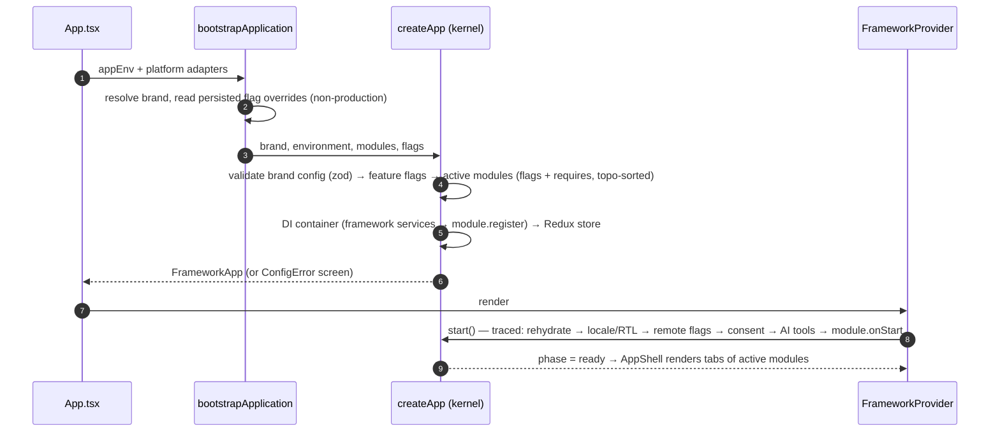
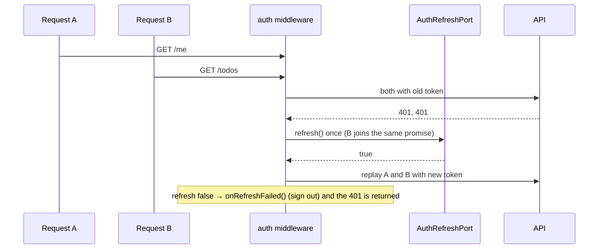

# Architecture

One Expo app. Inside it: **features** (your product) composed by an **app shell**, customised by **brands**, and
powered by a **built-in framework** (`src/framework`, ports & adapters). Everything above the adapters is plain
TypeScript that runs in Jest without a device.



## Folders

```text
src/app/          App.tsx · AppShell.tsx (tabs from active modules) · modules.ts · env.ts
  bootstrap/      bootstrapApplication.ts (composition root) · adapters.ts (native/vendor SDKs) · brands.ts · mockBackend.ts
src/features/<f>/ domain/ · data/ · presentation/ · ai/ · tokens.ts · translations.ts · module.ts · __tests__/
src/brands/<id>/  index.ts (defineBrand) · native.json (store identity) · features.json (flag values)
src/config/       feature-flags.json (registry) · featureFlags.ts (typed hooks)
src/framework/    foundation · di · observability · storage · network · state · i18n · theme · presentation · ui · ai · core · testing
```

Aliases: `@framework/<module>`, `@features/…`, `@brands/…`, `@config/…`, `@app/…` (tsconfig `paths`, mirrored by Jest; Metro reads tsconfig).

## Dependency rules (ESLint enforces these)

| From                | May import                                                                  | May not import                                                         |
| ------------------- | --------------------------------------------------------------------------- | ---------------------------------------------------------------------- |
| `src/framework/<m>` | modules listed for it in `src/framework/layers.json`                        | app, features, brands, config; other modules' internals                |
| `src/features/<f>`  | `@framework/*` entry points, `@config/*`, other features' `module`/`tokens` | `@app/*`, `@brands/*`, other features' `domain`/`data`/`presentation`  |
| `features/*/domain` | foundation-level framework types                                            | React, RN, Redux, network, storage, ui, core, `data/`, `presentation/` |
| `features/*/data`   | domain, framework I/O modules                                               | `presentation/`, React, RN, ui                                         |
| `src/brands/<b>`    | `@framework/*`                                                              | app, features                                                          |

Framework layers: `foundation` ← `di` ← `observability`, `storage`, `i18n` · `theme`, `presentation` ← foundation ·
`network` ← observability · `state` ← storage · `ui` ← theme, i18n · `ai` ← network · `core` ← all · `testing` ← core.
To add an edge, edit `layers.json` and justify it.

## Framework modules

| Module        | Owns                                                                                       | Ports you implement                                             |
| ------------- | ------------------------------------------------------------------------------------------ | --------------------------------------------------------------- |
| foundation    | `Result`, `AppError`, `Emitter`, `ObservableStore`, backoff, `singleFlight`                | `Parser<T>` (zod-compatible)                                    |
| di            | typed container, `Token<T>`, lifetimes, multi-bindings, cycle detection                    | —                                                               |
| observability | logger (PII redaction), consent-aware analytics, tracer (`traceparent`)                    | `LogSink`, `CrashReporter`, `AnalyticsProvider`, `SpanExporter` |
| storage       | namespacing, typed/TTL entries, SQL migrations                                             | `KeyValueStore`, `SecureStore`, `Database`                      |
| network       | REST (`Result`), middleware, GraphQL, WebSocket, graphql-ws                                | `HttpTransport`, `AccessTokenProvider`, `AuthRefreshPort`       |
| state         | Redux store factory, persistence + migrations, shell slices (`app`, `session`, `settings`) | —                                                               |
| i18n          | interpolation, plurals, fallback chains, RTL                                               | `LayoutDirectionAdapter`                                        |
| theme         | design tokens, light/dark, WCAG contrast audit                                             | —                                                               |
| presentation  | `ViewModel` (MVVM), `MviStore` (MVI) + hooks                                               | —                                                               |
| ui            | atomic components, brand override registry                                                 | `UIComponentMap` slots                                          |
| ai            | chat/stream client, tool registry, agent loop, SSE                                         | `AIClient`, `AITool`                                            |
| core          | brand config, modules (+tabs), kernel, feature flags, `FrameworkProvider`                  | `PlatformAdapters`, `RemoteConfigProvider`                      |
| testing       | `createTestApp`, `renderWithFramework`, mock transport                                     | —                                                               |

## Boot sequence



Module flags are evaluated during composition, so changing one needs a restart. Services are lazy factories, so modules can provide ports (e.g. auth tokens) before the HTTP client is built.

## Request pipeline

`brand headers + Accept-Language → tracing (traceparent) → logging → retry (idempotent, backoff, Retry-After) → auth → module middleware → status check → transport`



Clients never throw: they return `Result<HttpResponse<T>, AppError>` with `code` (`network`, `timeout`, `unauthorized`,
`http`, `validation`…), `retryable` and `userMessageKey`.

## Where state lives

| State                                          | Home                                                               |
| ---------------------------------------------- | ------------------------------------------------------------------ |
| Secrets (tokens)                               | `SecureStoreToken`                                                 |
| App-wide / persisted (session, settings, cart) | Redux slice; persist via `module.persist`                          |
| Server data                                    | repository (+ cache decorator)                                     |
| Screen state                                   | `ViewModel` (CRUD) or `MviStore` (state machines, auditable flows) |

## Patterns

Ports & Adapters (every vendor) · DI (constructor injection) · Module/Plugin (`FrameworkModule`, multi-bindings) ·
Repository · Decorator (`CachedTodoRepository`, `withObservability`) · Chain of Responsibility (HTTP middleware) ·
Composite (analytics, sinks) · Registry (UI slots, tools, flags, tabs) · Feature Toggle · Single-flight (token refresh).
