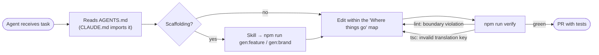

# AI-native development

"AI-native" means two things here.

## 1. Built for AI coding agents

| Asset                                                                                             | Purpose                                                                                                      |
| ------------------------------------------------------------------------------------------------- | ------------------------------------------------------------------------------------------------------------ |
| [`AGENTS.md`](https://github.com/llRizvanll/Mobile-Apps-Framework/blob/main/AGENTS.md)            | Commands, invariants, where code goes, definition of done                                                    |
| [`CLAUDE.md`](https://github.com/llRizvanll/Mobile-Apps-Framework/blob/main/CLAUDE.md)            | Imports AGENTS.md and adds Claude Code specifics                                                             |
| [`llms.txt`](https://github.com/llRizvanll/Mobile-Apps-Framework/blob/main/llms.txt)              | Index of docs for LLMs                                                                                       |
| [`.claude/skills/`](https://github.com/llRizvanll/Mobile-Apps-Framework/tree/main/.claude/skills) | `new-feature`, `new-brand` skills                                                                            |
| Generators                                                                                        | Agents scaffold correct structure instead of copying files                                                   |
| Package READMEs                                                                                   | Local API context next to the code                                                                           |
| Enforcement                                                                                       | Architecture lint, strict types, typed i18n keys and brand contract tests give agents fast, precise feedback |

Everything an agent could get wrong in a way that matters is caught by `npm run verify`.

## 2. Built for AI features in apps

See the [AI agent workflow](../workflows/ai-agent.md): a vendor-neutral client, tools on use cases, confirmation for side effects, observability without logging content, and a scripted client for tests.
