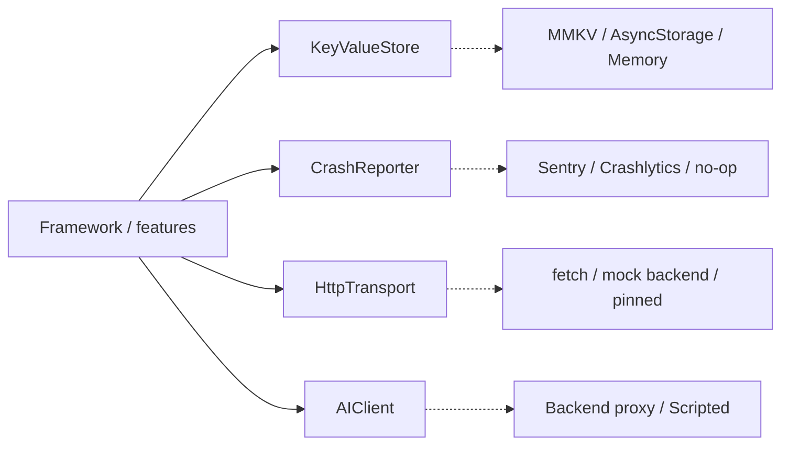

# Core concepts

## Ports & adapters

A **port** is an interface the framework depends on. An **adapter** implements it for a specific vendor.



Apps pass adapters once through `PlatformAdapters`; everything else stays vendor-agnostic.

## Tokens & the container

```ts
export const TodoRepositoryToken = createToken<TodoRepository>('todos.Repository');
c.bind(GetTodosToken).toClass(GetTodos, [TodoRepositoryToken] as const); // checked against the constructor
const repo = resolver.get(TodoRepositoryToken); // inferred: TodoRepository
```

## Result & AppError

```ts
const res = await http.get('/todos', { parser: todoListDtoSchema });
if (!res.ok) return res.error.retryable ? serveCache() : res; // code, retryable, userMessageKey
```

## Modules

A `FrameworkModule` bundles DI bindings, reducers, translations, AI tools and `onStart`/`onStop`. Modules can depend on each other, can be gated by a feature flag, and are started in dependency order.

## Brand definition

`defineBrand({ config, environments, theme, translations, components, modules })`. `config` is plain data and validated with zod; the rest is code.

## ViewModel & MviStore

|                   | ViewModel (MVVM)           | MviStore (MVI)                         |
| ----------------- | -------------------------- | -------------------------------------- |
| Changes state via | methods (`vm.add()`)       | intents (`dispatch({ type: 'send' })`) |
| Async work        | `launch()` / async methods | `effects(intent, ctx)`                 |
| One-off events    | callbacks                  | `emit(effect)` + `useMviEffects`       |
| Best for          | CRUD screens               | state machines, chat, checkout         |

## AI tools

```ts
defineTool({
  name: 'todos.add',
  inputSchema,
  parser,
  requiresConfirmation: true,
  execute: (input) => addTodo.execute(input.title),
});
```

Tools go through the same use cases as the UI, so the business rules apply to agents too.

See the [glossary](../glossary.md) for every term.
