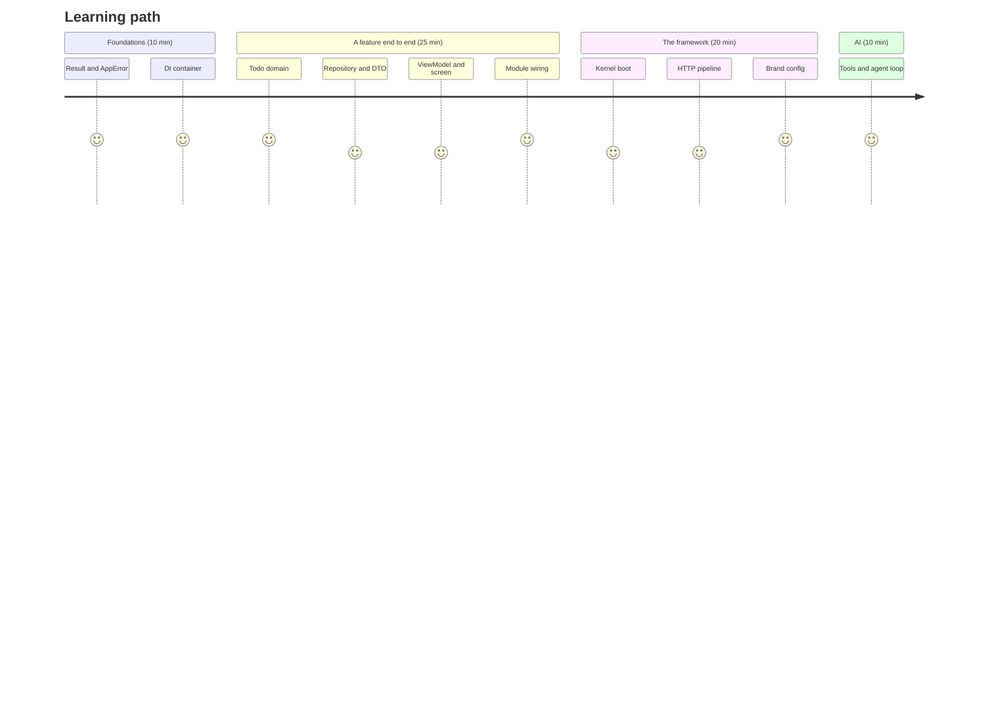

# Repo tour

A suggested reading order that takes about an hour. Each stop builds on the previous one.

| #   | Read                                                                                                                                                                                                                                                                                                              | Why                                           |
| --- | ----------------------------------------------------------------------------------------------------------------------------------------------------------------------------------------------------------------------------------------------------------------------------------------------------------------- | --------------------------------------------- |
| 1   | [`packages/foundation/src/result.ts`](https://github.com/llRizvanll/Mobile-Apps-Framework/blob/main/packages/foundation/src/result.ts), [`errors.ts`](https://github.com/llRizvanll/Mobile-Apps-Framework/blob/main/packages/foundation/src/errors.ts)                                                            | How every failure is represented              |
| 2   | [`packages/di/src/container.ts`](https://github.com/llRizvanll/Mobile-Apps-Framework/blob/main/packages/di/src/container.ts)                                                                                                                                                                                      | How dependencies are wired without decorators |
| 3   | [`features/todos/domain/`](https://github.com/llRizvanll/Mobile-Apps-Framework/tree/main/apps/example/src/features/todos/domain)                                                                                                                                                                                  | Business rules with no framework code         |
| 4   | [`features/todos/data/`](https://github.com/llRizvanll/Mobile-Apps-Framework/tree/main/apps/example/src/features/todos/data)                                                                                                                                                                                      | zod at the boundary, cache decorator          |
| 5   | [`TodoListViewModel.ts`](https://github.com/llRizvanll/Mobile-Apps-Framework/blob/main/apps/example/src/features/todos/presentation/TodoListViewModel.ts) → [`TodoListScreen.tsx`](https://github.com/llRizvanll/Mobile-Apps-Framework/blob/main/apps/example/src/features/todos/presentation/TodoListScreen.tsx) | MVVM with optimistic updates                  |
| 6   | [`features/todos/module.ts`](https://github.com/llRizvanll/Mobile-Apps-Framework/blob/main/apps/example/src/features/todos/module.ts)                                                                                                                                                                             | How a feature plugs in                        |
| 7   | [`apps/example/src/bootstrap/`](https://github.com/llRizvanll/Mobile-Apps-Framework/tree/main/apps/example/src/bootstrap)                                                                                                                                                                                         | The composition root                          |
| 8   | [`packages/core/src/kernel.ts`](https://github.com/llRizvanll/Mobile-Apps-Framework/blob/main/packages/core/src/kernel.ts) + [boot workflow](../workflows/app-boot.md)                                                                                                                                            | What happens at startup                       |
| 9   | [`packages/core/src/services.ts`](https://github.com/llRizvanll/Mobile-Apps-Framework/blob/main/packages/core/src/services.ts) + [request lifecycle](../workflows/request-lifecycle.md)                                                                                                                           | The HTTP pipeline                             |
| 10  | [`brands/acme/src/index.tsx`](https://github.com/llRizvanll/Mobile-Apps-Framework/blob/main/brands/acme/src/index.tsx)                                                                                                                                                                                            | Everything a brand can change                 |
| 11  | [`features/todos/ai/tools.ts`](https://github.com/llRizvanll/Mobile-Apps-Framework/blob/main/apps/example/src/features/todos/ai/tools.ts) → [`assistantStore.ts`](https://github.com/llRizvanll/Mobile-Apps-Framework/blob/main/apps/example/src/features/assistant/presentation/assistantStore.ts)               | AI tools and MVI                              |
| 12  | [`TodoListScreen.test.tsx`](https://github.com/llRizvanll/Mobile-Apps-Framework/blob/main/apps/example/src/features/todos/__tests__/TodoListScreen.test.tsx)                                                                                                                                                      | How everything is tested together             |

**Exercise**: run `npm run gen:feature -- notes`, make its list screen reachable from `App.tsx`, and get `npm run verify` green.
