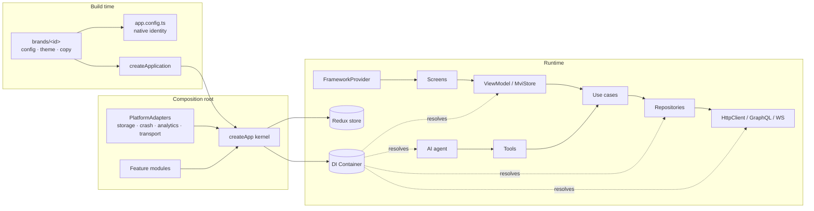

# Workflows

Diagrams that show how the framework behaves at runtime and how the team works with it.
Each page pairs a Mermaid diagram with the source files involved. The diagrams render on GitHub and on the docs site.

## Runtime

| Workflow                                          | What you'll learn                                                                                         |
| ------------------------------------------------- | --------------------------------------------------------------------------------------------------------- |
| [App boot](./app-boot.md)                         | `createApp` → `start()` → `FrameworkProvider`: config validation, DI, rehydration, locale, flags, modules |
| [Request lifecycle](./request-lifecycle.md)       | REST middleware pipeline, 401 → single-flight token refresh, retries, GraphQL, WebSocket reconnects       |
| [State & persistence](./state-and-persistence.md) | Where state lives, Redux shell slices, versioned persistence and migrations                               |
| [AI agent loop](./ai-agent.md)                    | How features expose tools, how the agent calls them, human confirmation                                   |

## Team

| Workflow                                        | What you'll learn                                            |
| ----------------------------------------------- | ------------------------------------------------------------ |
| [Feature development](./feature-development.md) | Idea → generator → domain/data/presentation → tests → PR     |
| [White-label release](./white-label-release.md) | New brand → contract tests → per-brand native build → stores |
| [Testing strategy](./testing.md)                | Test pyramid, which harness to use for which layer           |
| [CI/CD](./ci-cd.md)                             | What runs on every PR, docs deployment, bundle matrix        |

## The whole picture

