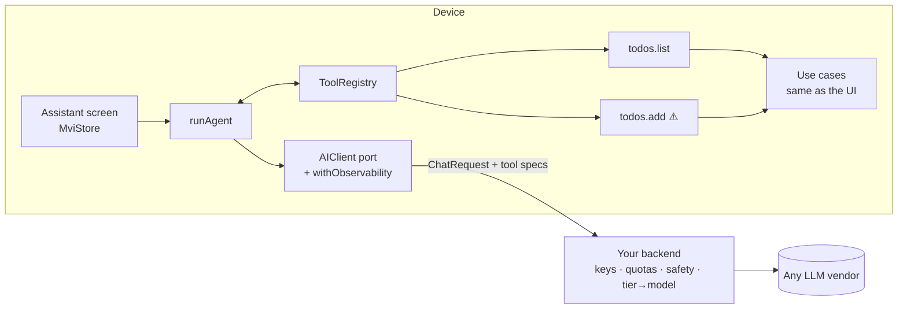
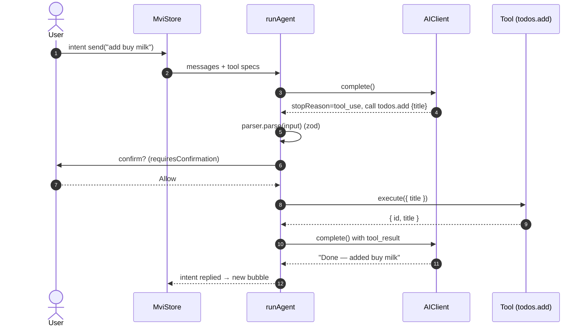

# AI agent loop

**Source**: [`packages/ai/src`](https://github.com/llRizvanll/Mobile-Apps-Framework/tree/main/packages/ai/src), example [`features/assistant`](https://github.com/llRizvanll/Mobile-Apps-Framework/tree/main/apps/example/src/features/assistant), tools in [`features/todos/ai/tools.ts`](https://github.com/llRizvanll/Mobile-Apps-Framework/blob/main/apps/example/src/features/todos/ai/tools.ts)

## Architecture



The app never holds vendor API keys. It sends **logical model tiers** (`fast` / `balanced` / `smart`), and the backend maps them to real models.

## One conversation turn



## Safety rails

| Rail                                                                            | Where                                                       |
| ------------------------------------------------------------------------------- | ----------------------------------------------------------- |
| Tools call **use cases**, never HTTP or storage directly                        | convention, checked in review (`AGENTS.md` invariant 8)     |
| Model input is validated with zod before execution                              | `AITool.parser`                                             |
| Side effects need user confirmation                                             | `requiresConfirmation: true` → `confirm` callback           |
| Tool failures go back to the model as `isError` results (the model can recover) | `runAgent`                                                  |
| Runaway loops are stopped                                                       | `maxSteps` (default 8)                                      |
| No prompt or response content in logs                                           | `withObservability` logs sizes, tiers, latency, tokens only |
| Cancel on unmount                                                               | `AbortSignal` from the MVI store                            |

## Testing without a model

```ts
const client = new ScriptedAIClient([
  toolUseResponse('c1', 'todos.add', { title: 'Buy milk' }),
  textResponse('Added!'),
]);
```

The example app also ships a rule-based fake backend (`bootstrap/mockBackend.ts`), so the whole loop runs offline.
