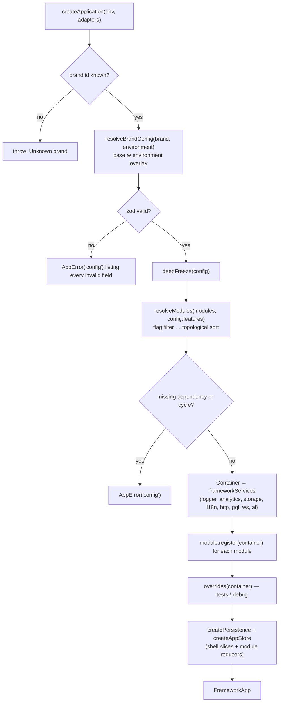
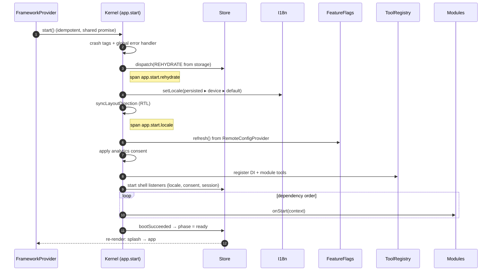
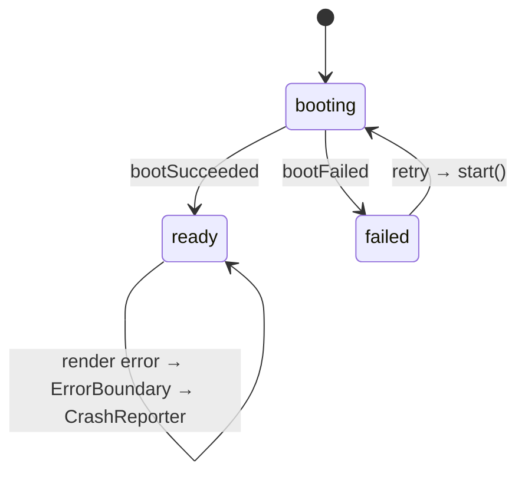

# App boot

**Source**: [`packages/core/src/kernel.ts`](https://github.com/llRizvanll/Mobile-Apps-Framework/blob/main/packages/core/src/kernel.ts), [`FrameworkProvider.tsx`](https://github.com/llRizvanll/Mobile-Apps-Framework/blob/main/packages/core/src/react/FrameworkProvider.tsx), [`apps/example/src/bootstrap/`](https://github.com/llRizvanll/Mobile-Apps-Framework/tree/main/apps/example/src/bootstrap)

Boot has two phases. The **synchronous** phase (`createApp`) fails fast on configuration errors. The **asynchronous** phase (`app.start()`) does I/O, and each step is traced.

## 1. Composition (synchronous)

Services are registered as **lazy factories**. Nothing is instantiated until first use, so a module can still override a binding (for example `AccessTokenProviderToken`) before the HTTP client is built.

## 2. Start (asynchronous, traced)

If any step throws, the kernel dispatches `bootFailed`, reports to the crash reporter, and resets so that **Retry** calls `start()` again.

## 3. What the provider renders

Provider nesting: `Redux → DI Container → I18n → Theme (persisted preference) → UI overrides → ErrorBoundary → your app`.

## Shutdown

`app.stop()` is idempotent. It runs `onStop` on modules in reverse dependency order, removes listeners, **flushes persistence**, and disposes the container (any `Disposable` singletons).
