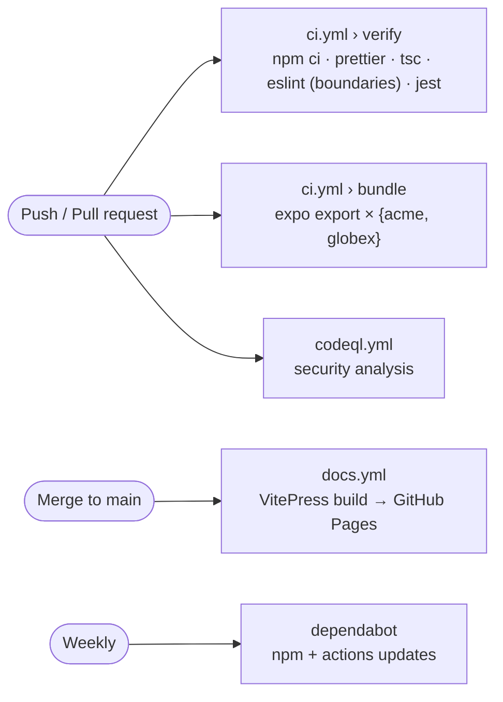

# CI/CD

**Source**: [`.github/workflows`](https://github.com/llRizvanll/Mobile-Apps-Framework/tree/main/.github/workflows)



| Workflow          | Trigger                                  | Gate                                                           |
| ----------------- | ---------------------------------------- | -------------------------------------------------------------- |
| `ci.yml` › verify | push to `main`, every PR                 | formatting, strict types, lint (incl. architecture), all tests |
| `ci.yml` › bundle | same                                     | Metro can bundle the app for every brand                       |
| `codeql.yml`      | push, PR, weekly                         | JavaScript/TypeScript security queries                         |
| `docs.yml`        | push to `main` touching docs or packages | builds and deploys this site                                   |
| `dependabot.yml`  | weekly                                   | grouped dependency update PRs                                  |

## Local equivalent

```bash
npm run format:check && npm run verify
npm run docs:build
```

## Suggested next: native release

Add EAS Build/Submit jobs keyed by the same brand matrix (`EXPO_PUBLIC_BRAND`) to produce signed store builds per brand.
