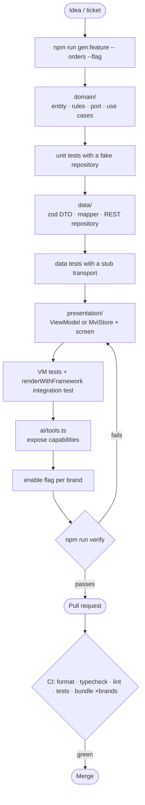
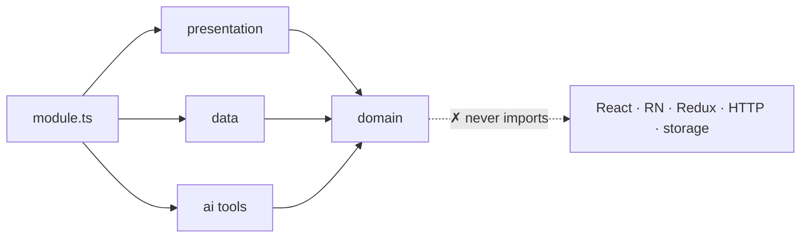

# Feature development

## Dependency rule

ESLint enforces this. For example, importing `@org/network` from `domain/` fails lint with _"domain/ defines ports; data/ implements them."_

## Choosing MVVM vs MVI

| Signal                                                                                  | Pick                                |
| --------------------------------------------------------------------------------------- | ----------------------------------- |
| List/detail/form, a handful of commands                                                 | **ViewModel** (`TodoListViewModel`) |
| Explicit states and transitions, async orchestration, a need to replay or audit intents | **MviStore** (`assistantStore`)     |

Both are plain classes/functions with no React, so tests run without rendering.

## Definition of done

- [ ] Domain rules return `Result`; user-facing errors carry `userMessageKey`
- [ ] Every locale the target brands support has translations (typed with `Shape<typeof en>`)
- [ ] No hard-coded colours, spacing or copy
- [ ] Mutating AI tools set `requiresConfirmation: true`
- [ ] Tests at domain, data and integration level
- [ ] `npm run verify` is green

See also: [Building features](../features.md) · [Testing strategy](./testing.md)
