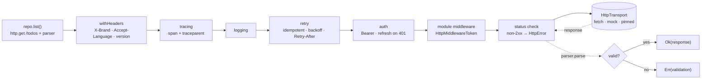
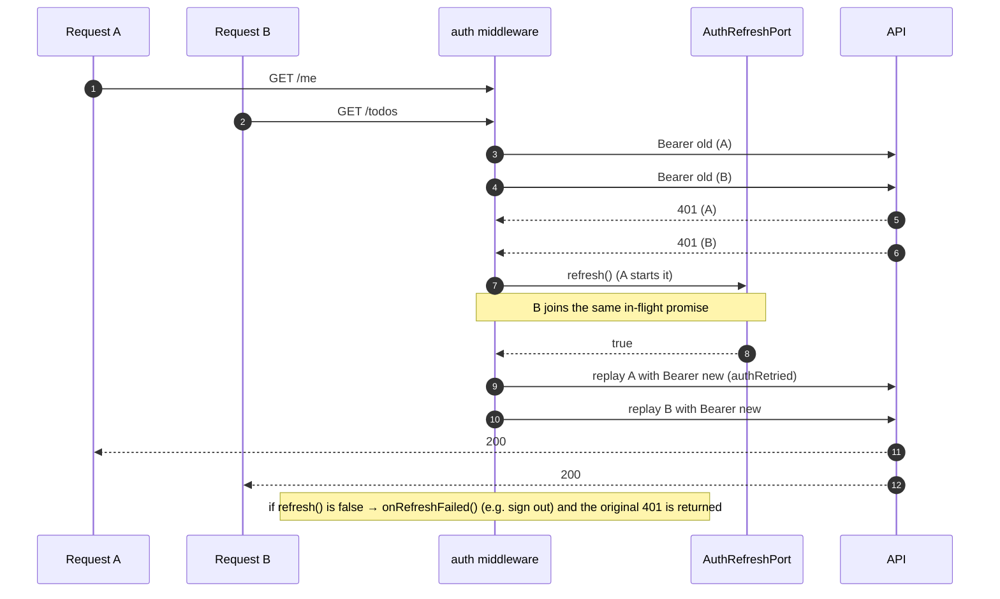
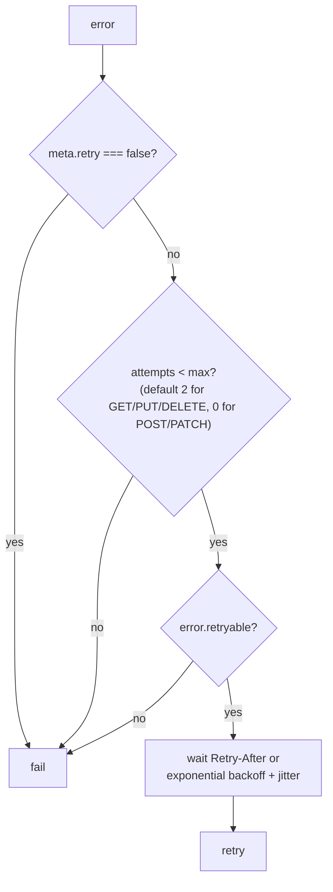
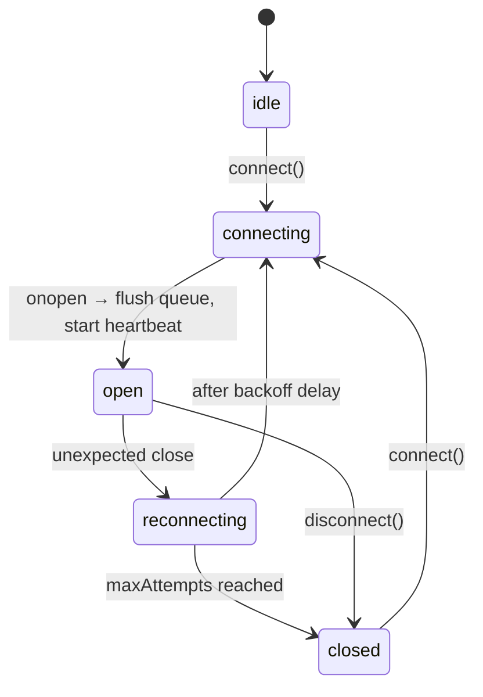

# Request lifecycle

**Source**: [`packages/network/src`](https://github.com/llRizvanll/Mobile-Apps-Framework/tree/main/packages/network/src), wiring in [`packages/core/src/services.ts`](https://github.com/llRizvanll/Mobile-Apps-Framework/blob/main/packages/core/src/services.ts)

## The pipeline

Middleware runs outermost-first. Each layer can change the request, short-circuit, retry, or translate errors.

**Nothing throws to the caller.** The client always returns `Result<HttpResponse<T>, AppError>`:

| Failure                                     | `error.code`                               | `retryable` |
| ------------------------------------------- | ------------------------------------------ | ----------- |
| No connectivity / DNS / raw transport throw | `network`                                  | ✅          |
| Timeout                                     | `timeout`                                  | ✅          |
| 401 / 403 / 404                             | `unauthorized` / `forbidden` / `not_found` | ❌          |
| 408, 429, 5xx                               | `http`                                     | ✅          |
| Payload failed the zod schema               | `validation`                               | ❌          |
| Caller aborted                              | `aborted`                                  | ❌          |

## Token refresh (single flight)

When several requests fail with 401 at the same time, there is **one** refresh, and each request is replayed once.

Your auth feature binds two ports: `AccessTokenProviderToken` (read the token, usually from `SecureStoreToken`) and `AuthRefreshPortToken`.

## Retry policy

## GraphQL

Queries and mutations go through the **same** `HttpClient`, so auth, tracing and logging apply to them unchanged. Mutations are never retried automatically. With `errorPolicy: 'none'` (the default), any GraphQL error returns `Err(graphql)`; an `UNAUTHENTICATED` extension maps to `unauthorized`.

## WebSocket and subscriptions

`GraphQLSubscriptionClient` speaks `graphql-transport-ws`. On each `open` it sends `connection_init` (with a fresh bearer token), waits for `connection_ack`, then **re-subscribes every active subscription**. That makes reconnects invisible to screens.
