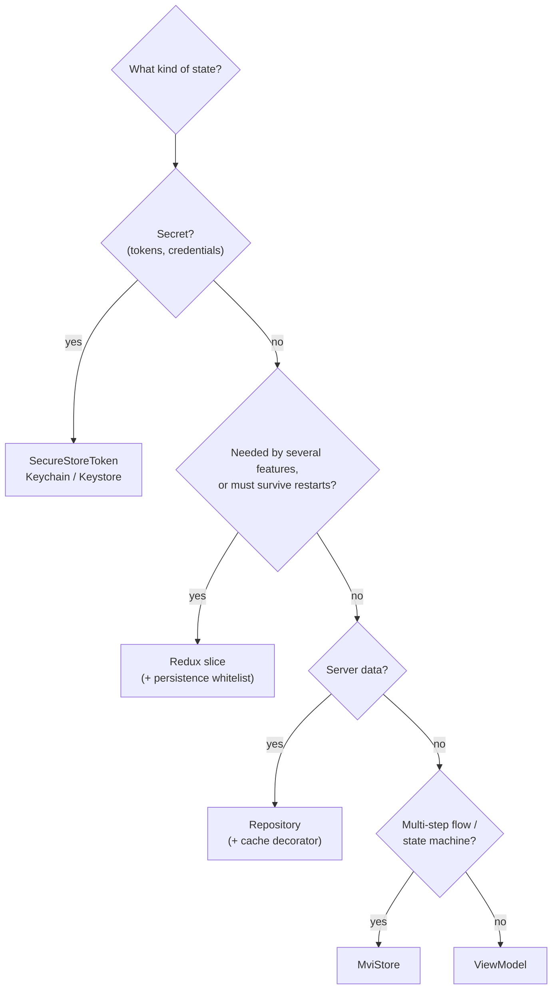
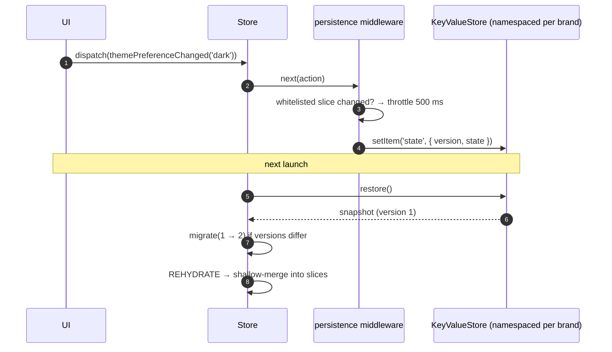

# State & persistence

## Where does this state go?

| Layer                | Examples                                  | Lifetime         |
| -------------------- | ----------------------------------------- | ---------------- |
| `app` slice          | boot phase, foreground/background, online | session          |
| `session` slice      | auth status, user id (**no tokens**)      | persisted        |
| `settings` slice     | theme, locale, analytics consent          | persisted        |
| Feature slices       | cart, drafts shared across screens        | opt-in persisted |
| ViewModel / MviStore | form input, list state, loading flags     | screen           |
| Repository cache     | last good list for offline use            | `KeyValueStore`  |

## Persistence flow

- **Lazy slices**: `injectReducer(key, reducer)` adds a slice at runtime and immediately rehydrates its persisted state.
- **Migrations**: bump `version` and supply `migrate(state, fromVersion)`. Snapshots that can't be migrated are dropped, not crashed on.
- **Flush**: `app.stop()` writes pending state immediately.

## Shell side effects

The kernel listens to shell actions so features don't have to:

| Action                             | Effect                                     |
| ---------------------------------- | ------------------------------------------ |
| `settings/localeChanged`           | `i18n.setLocale` + RTL sync                |
| `settings/analyticsConsentChanged` | enable/disable all analytics providers     |
| `session/signedIn`                 | crash reporter user + `analytics.identify` |
| `session/signedOut`                | clear crash user + `analytics.reset`       |
