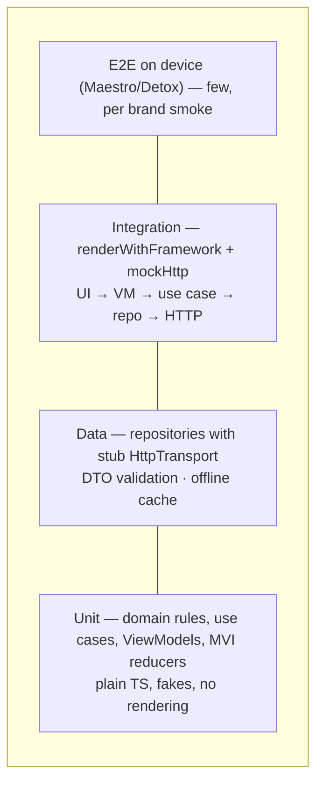

# Testing strategy



| Layer             | Tool                                            | Example                                     |
| ----------------- | ----------------------------------------------- | ------------------------------------------- |
| Domain / use case | Jest (`*.test.ts`, Node env)                    | `features/todos/__tests__/domain.test.ts`   |
| ViewModel / MVI   | Jest + fakes                                    | `viewmodel.test.ts`, `assistant.test.ts`    |
| Data              | `createHttpClient({ transport })`               | `data.test.ts`                              |
| Integration       | `renderWithFramework` (`*.test.tsx`, RN preset) | `TodoListScreen.test.tsx`                   |
| Brand contract    | Jest                                            | `brands/acme/src/__tests__/brands.test.tsx` |

## Integration harness

```tsx
const { http, analytics, crash, spans } = await renderWithFramework(<TodoListScreen />, {
  modules: [todosModule],
  mockHttp: (http) => http.on('GET', '/todos', { data: { items: [] } }),
});
```

`createTestApp` wires **every** platform adapter to an observable in-memory double. Apps created in a test are stopped automatically after each test.

## Two Jest projects

| Project  | Matches                      | Environment                 |
| -------- | ---------------------------- | --------------------------- |
| `unit`   | `**/__tests__/**/*.test.ts`  | Node (fast)                 |
| `native` | `**/__tests__/**/*.test.tsx` | `@react-native/jest-preset` |

> React Native Testing Library v14 APIs are async: `await render(...)`, `await fireEvent.press(...)`.
