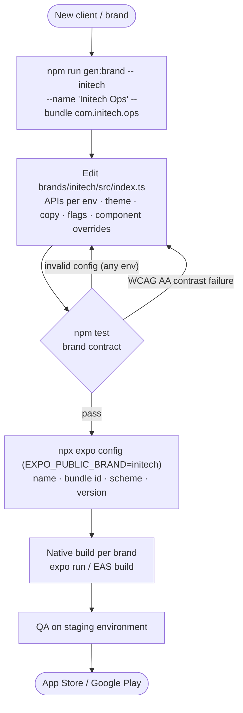
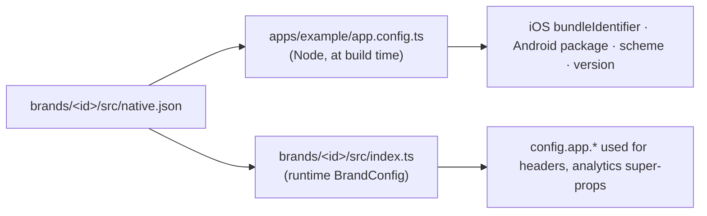
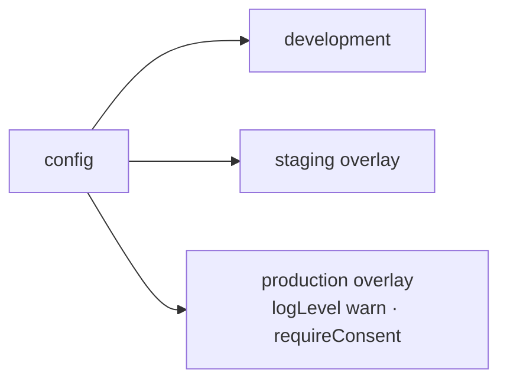

# White-label release

## From brand request to store



## One source of truth for identity



Because both sides read the same file, bundle IDs and versions can't drift between the native build and the JS runtime.

## Environments



Build commands:

```bash
cd apps/example
EXPO_PUBLIC_BRAND=globex EXPO_PUBLIC_ENV=staging EXPO_PUBLIC_API_MODE=live npx expo run:ios
```

## Brand repos (scaling out)

When a brand needs its own team or release cadence, move it to its own repository. The repo depends on published `@org/*` packages and contains the `brand/` package, its features, and a composition root copied from `apps/example/src/bootstrap/`. Upgrading the framework is then a version bump. See [Brands](../brands.md).
